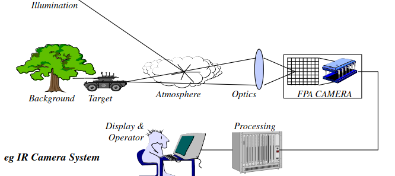
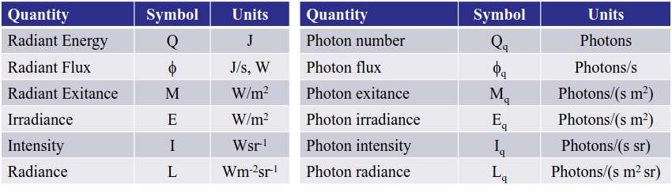
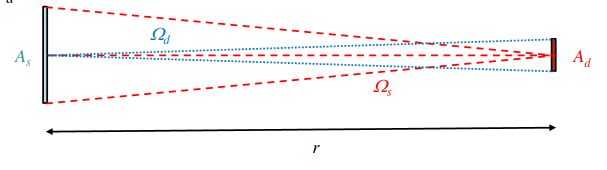
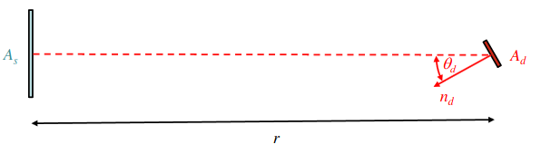

# Electro-Optics Systems Design Notes

## Introduction

So what constitutes and EO System? Well, there are 4 main components in each system:

1. A Sensor
2. Optics (either reflective or refractive)
3. Pointing or stabilisation
4. Electronics (this includes sightline control, processing and tracking)

### Benefits of EO
- **Passive technology**, meaning they don't need to emmit any illumination in order to detect. This means they can be more stealthy.
- **Shorter wavelength**, which improves the resolution as there is less diffraction

### Problems with EO
- **Limited range** (10-20km)
- **Can't work in all weathe**r, particularly water, as it absorbs the infrared radation/visible light

### Airbone EO - Basic Principle of Operation
- Better precision than RADAR, as it uses a beam to provide good resolution
- Downside, the range is lesser (very fine, like looking through a drinking straw)

### Targeting Pods

How it works
- Uses a IR camera as a sensor to accurately track a ground target in order to place laser energy onto it ('laser designation')
- This reflected energy then collected into the lens of an LGB (laser guided bomb)

What's requried here?
- High Resolution camera,  because you're dealing with bombs. 
- High LoS stabiliation, as with the high resolution, you will have really small FoV   
- Narrow field of regard (FoR, meaning the field where you place the sightline). 
- Slew rates (how fast the gimbal system moves) are slow

### Directed Infra-red Countermeasures
How it works
- Detects the launch of a SAM using the UV burst at launch
- Accurately tracks the missile seeker
- Places modulated IR energy onto the seeks to force it to break lock

What's required here?
- Good resolution camera, but it's a smaller range, so it's not as critical as it is in the tracking pods
- Good LoS, not as neccessary as the targeting pods though due to smaller range.
- Wide FoR, you need to reach **everywhere**. (The one part where you can't reach is where the missile will come from)
- Aggressive slew rate, again for the reaching. This means for it will need good tracking performance

### EO System Performance
- Calculated with a fully integrated model
- 2 systems that we can look in isolation: **Optical train** and **sightline pointing and stabilisation**

___

## EO Sensor Modelling
**Def**:  Derivation of performance of a devices taking into account of handling of output

## Radiometery
- When given a source and optical system configuration, how much power from the source is collected by the detector surface?
- There's a lot of radiometric terms that can be expressed in either energy or photon-based units:

- You can convert between the two unit bases by remembering that the amount of energy contained per photon:
$E = \frac{hc}{\lambda}$

### Radiometry Terms

- **Radiant flux**: The amount of radiant energy measured over time
     AKA $ \Phi = \frac{dQ}{dt}$
- **Exitance & Irradiance**:      
    - *Exitance* is how much flux is emmited from a source over a given area.
    - *Irradiance* is how much flux is recieved from the source over a given area
    - Both have the same equation: $M = \frac{d\Phi}{dA}$ for Exitance, and $E = \frac{d\Phi}{dA}$ for Irradiance
- **Intensity** : The amount of radiation energy from a point target (per solid angle) AKA $I = \frac{d\Phi}{d\Omega}$
- Radiance: The flux per unit projected area per solid angle AKA $L = \frac{d^2\Phi}{d(A\cos\theta)d\Omega}$ 

### A $\Omega$ Product
Consider the following case:

Where $A_d$ = detector angle, $A_s$ = source angle, $\Omega_s$ = source solid angle, $\Omega_d$ = detector solid angles, and $r$ = range

Therefore, assuming small angles, the flux on the detector: 

$ \Phi = LA_s\Omega_d = L\frac{A_sA_d}{r^2} = LA_d\Omega_s $ 

### Tilted Reciever
If your reciever is tilted wrt the source:

Then:

$ \Phi = LA_s\Omega_d = L\frac{A_sA_d\cos\theta_d}{r^2}$

## Lambertian Radiator
### Introduction
- Relying on reflected energy means you have to create some kind of model for this. 
- This can be done with physics-based rendering, where each material is assigned absorption characteristics to each material, which is very complicated.
- We can instead create a simplication called a **Lambertian surface**
- It's a surface where the radiance $L$ is independemt of view $\theta_s$, and that $L$ is constant
- This doesn't mean that it will radiation an equal amount of flux into all solid angles.
- Here, the relationship between $L$ and $M$ is: $M = L\pi$
### Relationship between Exitance and Radiance
- Assuming a Lambertian surface means any point on this surface radiates into a hemisphere
- The flux is then given by:
