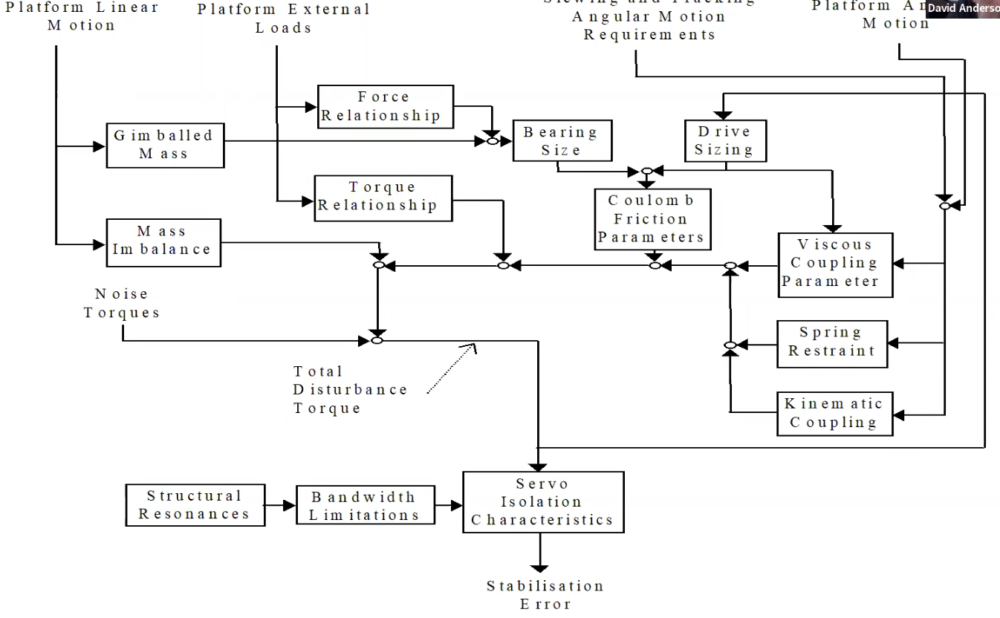

# Electro-Optics Systems Design Notes

## Introduction

So what constitutes and EO System? Well, there are 4 main components in each system:

1. A Sensor
2. Optics (either reflective or refractive)
3. Pointing or stabilisation
4. Electronics (this includes sightline control, processing and tracking)

### Benefits of EO
- **Passive technology**, meaning they don't need to emmit any illumination in order to detect. This means they can be more stealthy.
- **Shorter wavelength**, which improves the resolution as there is less diffraction

### Problems with EO
- **Limited range** (10-20km)
- **Can't work in all weather**, particularly water, as it absorbs the infrared radation/visible light
---
## Examples of EO Uses
### Airbone EO - Basic Principle of Operation
- Better precision than RADAR, as it uses a beam to provide good resolution
- Downside, the range is lesser (very fine, like looking through a drinking straw)

### Targeting Pods

How it works
- Uses a IR camera as a sensor to accurately track a ground target in order to place laser energy onto it ('laser designation')
- This reflected energy then collected into the lens of an LGB (laser guided bomb)

What's requried here?
- High Resolution camera,  because you're dealing with bombs. 
- High LoS stabiliation, as with the high resolution, you will have really small FoV   
- Narrow field of regard (FoR, meaning the field where you place the sightline). 
- Slew rates (how fast the gimbal system moves) are slow

### Directed Infra-red Countermeasures
How it works
- Detects the launch of a SAM using the UV burst at launch
- Accurately tracks the missile seeker
- Places modulated IR energy onto the seeks to force it to break lock

What's required here?
- Good resolution camera, but it's a smaller range, so it's not as critical as it is in the tracking pods
- Good LoS, not as neccessary as the targeting pods though due to smaller range.
- Wide FoR, you need to reach **everywhere**. (The one part where you can't reach is where the missile will come from)
- Aggressive slew rate, again for the reaching. This means for it will need good tracking performance

___

## EO System Performance
- Calculated with a fully integrated model
- 2 systems that we can look in isolation: **Optical train** and **sightline pointing and stabilisation**

___

## EO Sensor Modelling
**Def**:  Derivation of performance of a devices taking into account of handling of output

## Radiometery
- When given a source and optical system configuration, how much power from the source is collected by the detector surface?
- There's a lot of radiometric terms that can be expressed in either energy or photon-based units:

- You can convert between the two unit bases by remembering that the amount of energy contained per photon:
$E = \frac{hc}{\lambda}$

### Radiometry Terms

- **Radiant flux**: The amount of radiant energy measured over time
     AKA $ \Phi = \frac{dQ}{dt}$
- **Exitance & Irradiance**:      
    - *Exitance* is how much flux is emmited from a source over a given area.
    - *Irradiance* is how much flux is recieved from the source over a given area
    - Both have the same equation: $M = \frac{d\Phi}{dA}$ for Exitance, and $E = \frac{d\Phi}{dA}$ for Irradiance
- **Intensity** : The amount of radiation energy from a point target (per solid angle) AKA $I = \frac{d\Phi}{d\Omega}$
- **Radiance**: The flux per unit projected area per solid angle AKA $L = \frac{d^2\Phi}{d(A\cos\theta)d\Omega}$ 

### A $\Omega$ Product
Consider the following case:

Where $A_d$ = detector angle, $A_s$ = source angle, $\Omega_s$ = source solid angle, $\Omega_d$ = detector solid angles, and $r$ = range

Therefore, assuming small angles, the flux on the detector: 

$ \Phi = LA_s\Omega_d = L\frac{A_sA_d}{r^2} = LA_d\Omega_s $ 

### Tilted Reciever
If your reciever is tilted wrt the source:

Then:

$ \Phi = LA_s\Omega_d = L\frac{A_sA_d\cos\theta_d}{r^2}$

## Lambertian Radiator
### Introduction
- Relying on reflected energy means you have to create some kind of model for this. 
- This can be done with physics-based rendering, where each material is assigned absorption characteristics, which is very complicated.
- We can instead create a simplication called a **Lambertian surface**
- It's a surface where the radiance $L$ is independemt of view $\theta_s$, and that $L$ is constant
- This doesn't mean that it will radiation an equal amount of flux into all solid angles.
- Here, the relationship between $L$ and $M$ is: $M = L\pi$
### Relationship between Exitance and Radiance
- Assuming a Lambertian surface means any point on this surface radiates into a hemisphere. The flux is then given by:
  $\phi_{hemisphere} = \int L A \cos \theta_{s} d \Omega_{d}$ **(1)**

- In spherical coordinates:
$d\Omega_d= \frac{dA_d}{r^2}= \frac{r^2\sin \theta d \theta d \phi}{r^2} = sin \theta d \theta d \phi$ **(2)**
- Sub **(2)** into **(1)** :
$\phi_{hemisphere} =  \int_{-\pi}^{\pi}\int_{0}^{\pi/2}L A \cos \theta_{s} sin \theta d \theta d \phi$ **(3)** 
- Evaluate **(3)**
$\phi_{hemisphere} = \pi L A_s = MA_s$

### Off-Axis Detector
 Def: Where the target and detector are not parallel, and instead have non-zero view angles.

An example is shown here:

 
 Here the detector flux is 

 $\phi_d = L A_s \cos \theta_{s} \Omega_d = L A_s \cos \frac{A_d}{(r/\cos \theta_s)^2\leq }$

### Parallel Surfaces

Occurs in two offset parallel angles. 

An example is shown here:

Looking at the geometry the flux is:
$\phi_d = L A_s \cos \theta_{s} \Omega_d = L A_s \cos \frac{A_d \cos \theta_d}{(r/\cos \theta_s)^2}$

### Point Targets
Def: where the projected target area is much smaller than the range to the target, meaning the solid angle is $\approx 0$

An example is shown here (A model of a point target viewed by a camera)

For a circular lens:
$\Omega = \frac{\pi D^2}{4r^2}$

Therefore the flux (using the intensity) is: $\phi = I \Omega = I\frac{\pi D^2}{4r^2}$

We use the irradance on the detector here, as we don't need to consider the radiance on a point target.
Therefore, the irradiance is:
$E = \frac{\phi}{A_d} = \frac{I}{r^2}$

This here is known as the **inverse square law**. This showns as the irradiance increases, the range decreases. This is similar to RADAR, where the range is inversely proportional to the power. but is not as affecting.

___
## Atomspheric Transmission

- An important thing to model as, estimating flux losses from propgating through the atomsphere cannot be done just from first-principles. This means that models must have a signficant experimental component.
- It's more important here than in RADAR, as the atomsphere attenuates the optical radiation **a lot** more here.

The 3 main attenuation mechanisms are:

### 1. Absorption
Def: The process where energy contained in the photons are devoured by gas molecules and aerosols. This radiation gets transformed into KE and heat.
- Depends on the wavelength of the radiation
- This can lead to *transmission windows* (spectral bands where the attenuation is minimal). These look like this: 
### 2. Scattering
Def: where the photons are redirected along a different propagation path
- Scatter will depend on the ratio between the wavelength and the size of the particles obstructing the path of the photons.
### 3. Refraction
Def: Refracts the radiation due to the refractive index (RI) of the atomsphere
- RI is dependent on the current temperatue
- The refraction induces directional errors, which are more pronounced at long ranges and low altitudes over land and sea
---
## Target Models - Sources of Radiation
- How do we create a model of our actual target? There's lots of ways of doing it (CFD, FEA), and this is dependent on the level of exactness required
- Simplest model to use for our target = **blackbody**
- All target models will need to define emittance via target transmission, absorption or reflective properties.

### Transmission, Absorption & Reflection
- A material may transmit, reflect, absorb or emit radiation and in general doesmore than one of these at a time.
- For example, take the below diagram which shows light incident on a parallel plane: 
- Here, we can see from the beam of light, some is reflected ($\rho$), some is absorbed ($\alpha$) and some is transmitted ($\tau$).
- From the conservation of power, the sum of these powers must add up to the incident power:
$\Phi_0 =\Phi_a+\Phi_r+\Phi_t$
- If you normalise against the incident power, you get: $1 = \frac{\Phi_a}{\Phi_0} + \frac{\Phi_r}{\Phi_0} + \frac{\Phi_t}{\Phi_0} = \alpha + \rho + \tau$
- For a body with no net heat transfer (thermal equilibrium) the absorption and emmision properties are related via *Kirchoffs Law*
### Emissivity
- Def: the ratio of the radiant exitance of a real body to that of an ideal body
- Equation = $\epsilon(\lambda) = \frac{M(\lambda)}{M^{BB}(\lambda)}$ where $M^{BB}$ is the radiant exitance of a blackbody 
- A blackbody (the perfect emmiter) has n emissivity value $\epsilon$ of 1.0 or 100%
- The directional spectral emissivity = $\epsilon_d(\lambda,\theta,\phi) = \frac{L(\lambda,\theta,\phi) }{L^{BB}(\lambda)}$
---
## Optics
Optics are important to an EO system as they are needed to:
- Gather the radiative flux from a scene
- Magnify the components in the scene
- Transfer the flux to an EO detector via an **Optical Train**

The optical can be crudely represented by using **thin lens geometrical optics**.
### The thin lens approximation
This approximation states that we can replace a complex optical assembly with a single thin lens.

A diagram is shown below:

Where $p$ = object distance, $q$ = image distance, $h_o$ = object height, $h_i$ = image height, $f$ = focal length

Formulae:
- Focal length: $\frac{1}{f} = \frac{1}{p} + \frac{1}{q}$
- Optical magnification: $M = \frac{h_i}{h_o} = -\frac{q}{p}$

### Instantenous FoV (IFoV)
- Def: the angular coverage, defined in terms of either the full anfle or the half angle
- Adding the IFOV to the Thin lens diagram using the half angle definition looks like this:

$IFoV = | \tan^{-1}(\frac{h_i}{q})|$

### Diffraction Limit
- So, in optics theory, an image is compressed to an infitesimal point at the focal plane of the lens.
- An reality, the light is subject to interference effects. Due to diffraction, the flux of the light spreads out to form a disk pattern. 
- The spreading is known as the Point Spread Function. 
- This pattern defines the optical resolution.

### Spatial Frequency
- Def: How often a repeating pattern changes in a given distance or space.

- A cycle is distance between peaks of the same intensity.

### Modulation Transfer Function
Def: a measure of the effectiveness of an optical system for specific spatial frequencies. It is the Fourier Transform of the Point Spread Function.

From this graph, we can see that as the Spatial Frequency increases, the MTF decreases. As the SF increases, object becomes blurred due to diffraction, spatial sampling and other optical effects. Therefore, we could say that MTF tells us how the image is degraded.

Also, since it is the Fourier of the PSF, it obeys the principle of superposition, as shown below:

___

## Electro-Optic Detectors and Detector Performance

What do these do? Well, they produce a measurable electrical output in response to radiation intercepted by the sensing element.

This sensing is based on 2 principles:

1. Thermal Effects of radiation
2. Quantum Effects of radiation

### Thermal Detectors 
This includes:
- Bolometers
- Pyroelectrics
- Thermocouples

### Photodetectors AKA quantum detectors
- Operates via the *Photoelectric Effect*. Basically, it works by the photons in the radiation interacting with the atoms, and if the energy is sufficient, and electron will be moved from the **valence band** to the **covalance band**.
- In the covalence band, the electrons are free to move as current, which can then be measured.

### Detector Performance
- Since the detector is basically a transducer that converts electromagnetic flux into electrical signals, the spectral responsivity of the detector can be defined as: $\Re(\lambda) = \frac{V_{det}}{\phi_{det}}$
  - *Side note, a transducer is just a component that converts energy into one form or another*
- Thermal detectors had a flat response, by photons detecors response is a function of the wavelength.
- Spectral responsivity curves can be very different, but they all terminate at the **cut-off wavelength** $\lambda_{cut}$, which is the wavelength that contains just enough energy to cause an electron to cross the bandgap. Equation: $\lambda_{cut} = \frac{hc}{E_g}$
- Spectral responsvitivty can also be expressed in the frequency domain using the FT of the time-domain impulse response. 
### Noise Equivalent Bandwidth Come back to
- Def: the width of a flat bandpass filter that will pass the same amount of white-noise power as the original transfer function. 
- It can be found using the frequency response discussed previously (FT of the time domain impulse response.)
- Equation: $\Delta f = \int_{0}^{\infin} |\frac{\Re(f)}{\Re(f = 0)}|^2 df$

### Noise Sources
Some of the major Electo-Optic Noises:
- **Photon Noise**: caused by fluctuations in generation rate
- **Shot Noise** - due to the quantisation of photons and electron state
- **Dark Current** - A complex product of specific semiconductor construction. Found in photovoltaic devices
- **Fixed-Pattern Noise** - due to detector responsivitiy nonlinearities.

### Noise Equivalent Power
- Def: the amount of flux that would produce an output equal to the RMS value of the noise.
- This is used to specifiy the noise performance of a detector, in order to predict the SNR for a given amount of flux.
- Equation: $NEP = \frac{\phi_{det}}{SNR}$

### Specific Detectivity $(D^*)$
- Def: merit used to specifiy the performance of a detector.
- Equation: $D^* = \frac{\sqrt{Ad} \sqrt{\Delta f}}{NEP}$ where $Ad$ is the area of the photosensitive region, $\Delta f$ is the NE bandwidth.
- From this, we can we that $D*$ is inversely proportional to the NEP, so therefore a higher $D^*$ corresponds to a better sensitivity.

### Range performance

- Essentially, we want to convert all these EO System parameters into a range estimate, whilst keeping up with fine spatial resolution
- We want to keep up with spatial resolution, as you won't be able to recognise or identify a target, but only detect that it's there
- Johnson's Criteria = a set of criteria used to evaluate the performance of Electro-Optical systems. These criteria include Detection, Recognition, Indentification, Acquistion, FoV and Resolution.
  - $R = \frac{sf T_{size}}{N_{cyc}}$, where $sf$ = spatial frequency, $R$ = range , $T_{size}$ = size of target, $N_{cyc}$ = no of cycles need for task (Detection = 1, Recognition = 4)
___
## EO System Stabiliation and Tracking 
- The aim of stabilisation systems is to prevent/limit jitter.
  - Jitter = How does the LoS move away from what we want.
- Aim of tracking system = to follow target in space. AKA direct the LoS towards target.

Imagery collection
- Target must be kept in FoV under vehicle motion
- Helped with stabilsation

### Performance Requirements

Two fundamental functions for LoS stabilisation/tracking
- Dynamic disturbance isolation: allows us isolate the LoS from the disturbance
- Pointing: points the LoS where you need to.

### Stabilation Requriments

- **Jitter**: the human viewing bandwidth = 2Hz
  - Critical for those where a human must be in-the-loop, such as missile technology which requires human authorisation. Even if it has an automatic tracker system, it will still need that human check, and therefore human will have to checked wrt human viewing.
- Requirements of automatic tracker:
  - Sensor Sensitivity (SNR)
  - Resolution (Quanitified by MTF)
  - Frame-to-frame jitter (target following/tracking)
- Optical design
  - Optical magnification affects FoV. This is because as the magnification increases, the focal length of the lens is  also increases, meaning the area (+ details) captured by the sensor is reduced, which creates a smaller FoV.

### Stabilation Subsystem Design Relations

- **Gimballed Mass**: If there's an offset between the rotation axis the the sensors CoG, when the vehicle accelerates, you will get a torque, which will cause a measurement in the wrong direction.
- **Bearing size**: Affected by the gimballed mass. You will need consider the friction will be caused by the **gimballed mass**
-  **Coulomb friction parameters**: describes the amount of dry function that occurs between two surfaces.
- All values here add up to a **total disturbance torque**, which gets passed to a servo, with the servo isolation characterisitics.
- Here we need to consider the physical limits of the servo (Structural Resonances and Bandwidth Limitations) 
- The structural resonances mean you need to design your system to not perform at any resonances.
- The bandwidth limitations is how big your bandwidth can be with the servo. For low structural resonances, the bandwidth needs to be low. For a low total disturbance torque, the bandwidth needs to high. Therefore, a good controller for the total distubrance torque needs to be designed.

