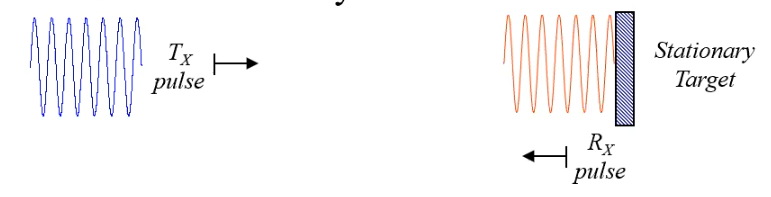
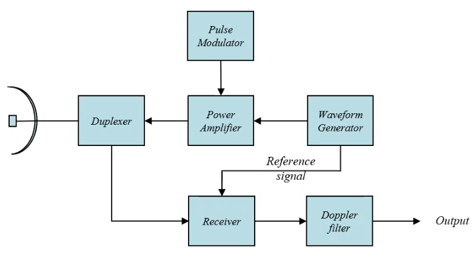
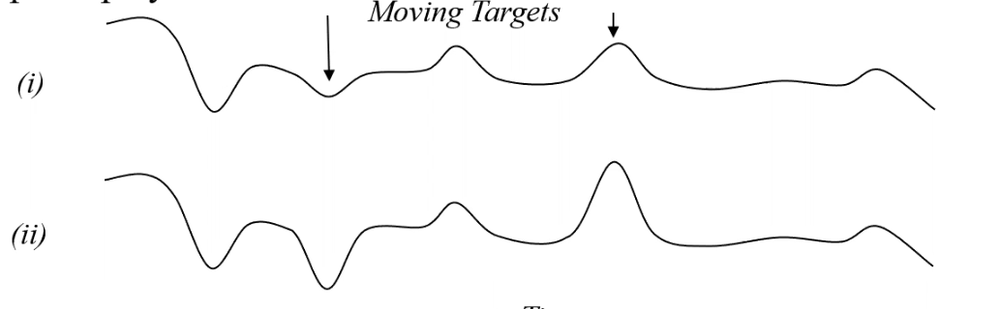
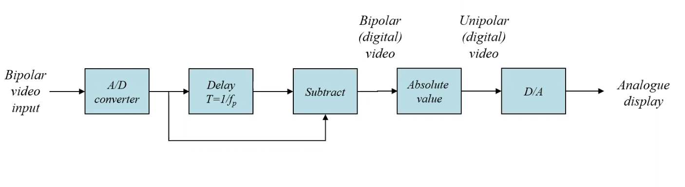
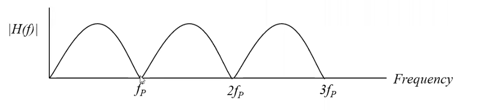
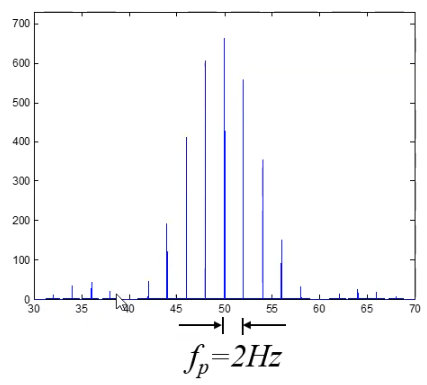
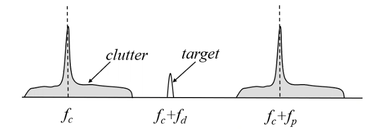
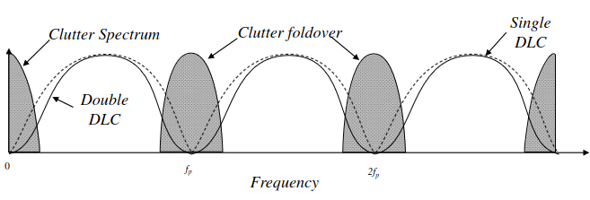
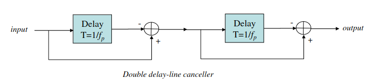

# MTI RADAR

## Introduction

- Def: MTI = Moving Target Indicator
- This RADAR allows us to get motion information of the targets (velocity, acceleration)

## Detection of Moving Targets

- Noise level of the natural environment (*clutter*) is many orders of magnitude larger than aircraft/target echoes.
- These are usually from the side lobes which are directed towards the ground, even though the main lobe will be directed at the aircraft. This means you will get returns from the ground which are closer in range than the target, which increases the noise.
- If the clutter and aircraft are both in the same RADAR resolution cell, then a missed detection may occur.
- We can remove the cutter easily using the Doppler effect, as we can assume our targets are going to be moving much faster than the clutter elements, and thus produce a higher frequency to them.
    - Doppler Effect = the change in frequency of an echo signal due to the relative velocity between the transmitter and the target.

### Derivation of the Doppler Frequency Shift

1. For a target of range R, the phase length of the two-way path: $\phi = \frac{2 \pi}{\lambda} \times 2R$
2. The rate of change of phase of a moving target will be: $\frac{d \phi}{dt} = \omega = \frac{4 \pi}{\lambda} \cdot \frac{dR}{dt} = \frac{4 \pi}{\lambda} v_r rad/sec$
3. The Doppler Frequency shift is therefore: $f_d = \frac{\omega}{2 \pi} = \frac{2v_r}{\lambda} Hz$

Therefore the Doppler shift is function of the range rate $v_r$.

### Pulse RADAR Doppler Shift 

- Doppler shift extraction is achieved by multiplication of the recieved signal with the transmitted waveform.
- Why does it do this? Well, it needs a reference signal to base the change in phase on. It needs a reference signal to know how much the pulse has changed, and therefore it it added here at the **reciever** block. This reference signal is known as a **coherent reference**.
- You can detect the Doppler Shift in 1 cycle, provided that $f_d \tau > 1$ AKA at least one the cycle of the Doppler Shift is whin the pulse.

## Sweep-to-Sweep Extraction

- Another method for eliminating clutter from moving targets.
- Def of Sweep: time between two transmitted pulses
- Two Sucessive sweeps are shown below:

- From the 2 successive sweeps, it is clear that any cluster/stationary returns are identical across the sweep, but the moving targets show up with different amplitudes on the 2 sweeps. This is due to the Doppler Effect. 
- Therefore, we subtract the sweeps, the stationary targets are removed.

### Delay-line Canceller

- Subtraction of the sweeps are accomplished in a delay line canceller, as shown above.
- So, the way it works is it converts the signal to the digital domain, delays it by one time step in order to subtract the previous from the original, take the absolute of the subtraction, then convert it back to analog.

### Delay-line Canceller Frequency Response

- You can have multiple Delay Line cancellers.
- The signal at the phase detector output from a target at range $R_0$ as: $V_1 = k \sin (2 \pi f_d t - \phi_{0})$, where:
    - $\phi_{0}$ = a constant phase equal to $4 \pi R_{0} / \lambda$
    - $k$ = amplitude of the signal
- Then the signal from the previous pulse is: $V_{2} = k \sin[ 2 \pi f_d (t - T_p) - \phi_{0}]$

- Then, the output of the delay line canceller is then: $V = V_1 - V_2 = k \sin(\pi f_d T_p) \cos[2 \pi f_d (t - \frac{T_p}{2}) - \phi_{0}]$
- Here we have 2 terms, an amplitude term and a time-dependent harmonic term.
- The frequency response of the single delay-line canceller is: $H(f) = 2 \sin (\pi f_d T_p)$ 
- Plotted is: 
- This problematic due to:
    - Blind Speeds: the response of the single delay-line canceller will be zero whenever: $f_d = \frac{2 v_r}{\lambda} = \frac{n}{T_p} = n f_p$ for $n = 0,1,2,...$

### Coherent Pulse Spectrum 
- We can perform the Fourier Transform across multiple pulses, such as a pulse train.
- This pulse train in the Fourier Transform has a line spectrum, as shown below: 
- As you can see, it still follows the *sinc* function of a single pulse, but has now has pulse gaps between.
- Each gap width is equal to the PRF.

- The clutter is hard to predict, so instead we define it to be a delta function around zero Doppler frequency.
- The clutter power spectral density is represented by a Guassian function is: $W(f) = W_0 exp(- \frac{f^2}{2 \sigma_{c}^{2}}) = W_0 exp(- \frac{f^2 \lambda_{2}}{8 \sigma_{v}^{2}})$ Where:
    - $W_0$ = the peak value of the cluster power spectral density (psd)
    - $\sigma_{c}$ = standard deviation of the clutter spectrum in Hz
    - $\sigma_{v}$ = standard deviation of the clutter spectrum in metres/sec 
- This spectral density can be used in the calculation of the MTI performance through the MTI Improvement factor, which is a measure of clutter attenuation per DLC

- From this spectral density graph, we can see that the using double DLC are more effective at attenuating than single DLC

### Multiple Delay-Line Filters

- Above is the diagram of the multiple Delay-line Filters, which can be extended to an N-pulse delay line canceller.
### Delay-Line Canceller Frequency Response

1. Denote the signal at the phase detector output from a target at range: $V_1  = k \sin (2 \pi f_d t - \phi_0)$
2. The signal from the previous pulse is: $V_2  = k \sin (2 \pi f_d (t - T_p) - \phi_0)$
3. The output of the delay line canceller: $V = V_1 - V_2 = 