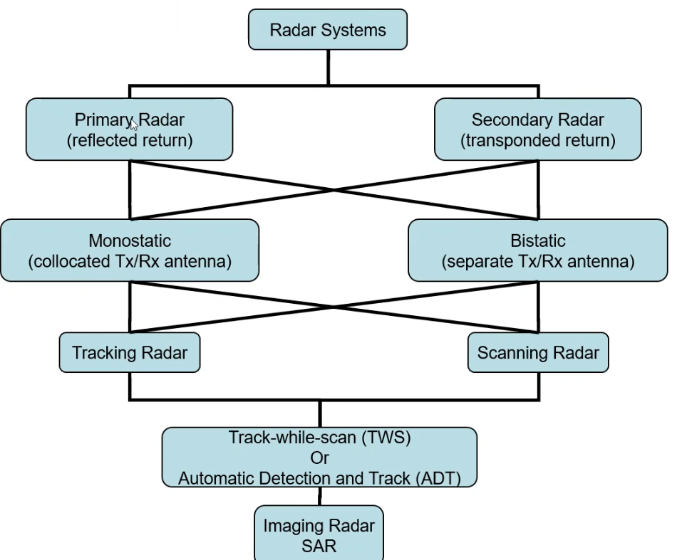
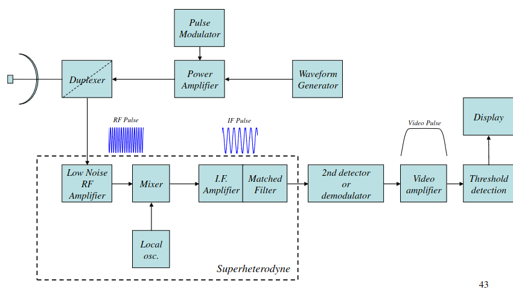
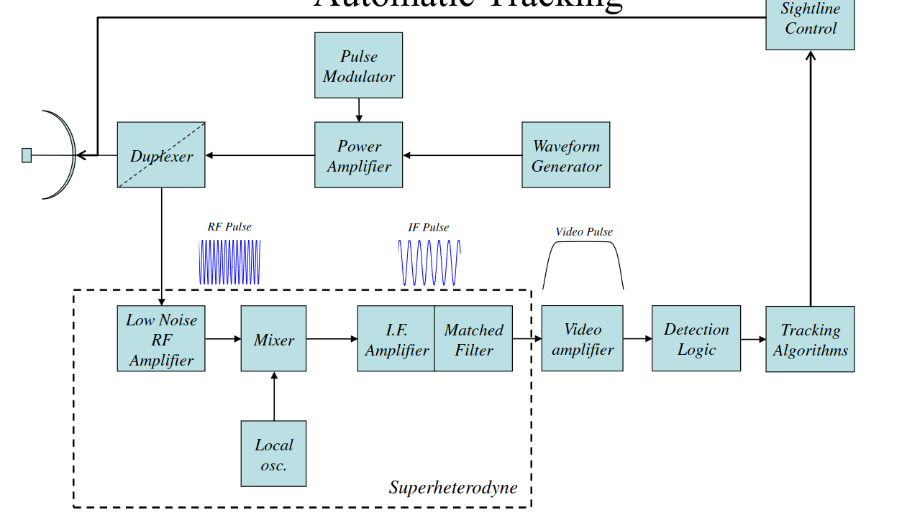
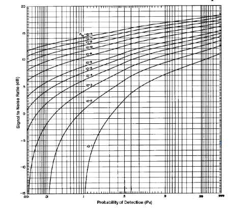
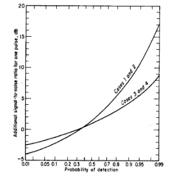
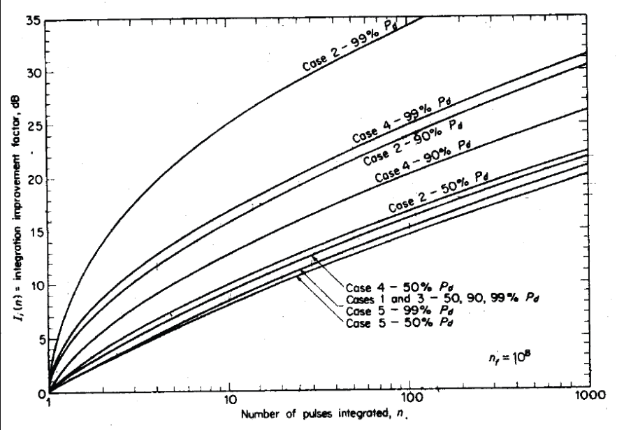

# RADAR Notes
## Introduction

### History
- Began in 1930s with radio frequencies of 30MHz
- Increased to 1-10GHz in the 40s due to military requirements
- Transferred to the civil sector in 1950s, with improvements made in the 60s and 70 with the advent of digital computers and signal processing
### Types of RADAR systems

- **Primary RADAR**: antenna transmitts a signal, bounces of target, returns to the base. Detects object using only the reflection of the radio waves
- **Secondary RADAR**: RADAR sends a signal, collected by onboard antenna, and uses a two-way communication system that allows the RADAR to identify and track the object. (Not really covered in the course)
- **Monostatic apporach**: transmit and reciever path are the same path. Single antenna does both broadcast and recieve
- **Bistatic/Multistatic approach**: seperate antennas for broadcasting and recieving the echo. The advantage of this is stelth technology. The majority of stelth-designed targets will be designed so that the transmitted energy (RADAR beam) will be reflected in a direction that is not the original one. Therefore, if it's seperate, then it's more likely to be able to pick up those targets. Also with multistatic, in military operations, you have multiple antennas to transmit/recieve if one goes down (gets blown up)
- **Tracking RADAR**: Used to precisely locate and track a specific object
- **Scanning RADAR**: Used to detect the presence of objects within a large area
- **TWS/ADT**: Covered in target tracking.
- **Imaging RADAR SAR**

### Pulse RADAR System Components

#### Display to Operator

- **Waveform generator**: generates the carrier waveform
- **Pulse modulator**: contains rect function.
- **Power amplifier**: inputs WG and Pulse, and does what it says. Outputs the transmit signals
- *Duplexer*: Dotted line shows it works for both transmit and reciever. Acts like a switch between them. When transmitting, there is 0 impedance across the power amplifier and $\infin$ impedance on the LNRFA. Vice versa for recieving.
- circlely thing AKA the antenn: Sends the signal
- **Low Noise RF Amplifier**: amplifies the reciever pulse, without introducing significant noise caused at high frequencies. Operating at radio frequencies, so limited components can be used. 
- *Superhetrodyne*: converts RF pulse to an Intermediate Frequency (IF) pulse by multplying it with the signal from the local oscillator.
    - We convert to improved selectivity, easier gain, demodulation and filtering.
- **Demodulator/Envelope detector**: truns the IF pulse into a video pulse.

#### Automatic Tracking

Differences between display operator
- **Detection logic** : Meant to replace a trained operator
- **Tracking algorithm**: find where our target is and where it's going
- **Sightline control**: moves depending on where the target is

### Super Hetrodyne Reciever
Def: A reciever that using the heterodyning technique to convert RF to IF, by combining the RF signal with a local oscillator at a difference frequency. When combined, the 2 new signals are produced: the sum frequency and the difference frequency. The sum frequency is then filtered out, leaving the desired IF frequency.

The equation of the superhetrodyne reciever:

$s_c(t) * s_{lo}(t) = \sin(2\pi f_{lo}t)$ **(1)**

Using Euler's theroem $\sin x = Im(e^{ix}) = \frac{e^{ix} - e^{-ix}}{2i}$:

$s_c(t) * s_{lo}(t) = \frac{i^2}{2} (\frac{e^{i2\pi (f_c + f_{lo})t} + e^{-i2\pi (f_c + f_{lo})t}}{2} - \frac{e^{i2\pi (f_c - f_{lo})t} + e^{-i2\pi (f_c - f_{lo})t}}{2})$

= 

$\frac{1}{2} \cos(2 \pi (f_c - f_{lo})t) - \frac{1}{2} \cos(2 \pi (f_c + f_{lo})t) $

Therefore:

$f_{IF} = f_c - f_{lo}$
___

## Radar Equation
### Introduction
The radar equation is a function made up of 2 parts: the **deterministic** parts which are under the designers control, and the **probabilistic** part which are not.

In this section, I've decided to to order it by each RADAR equation (Simplest, Simple, Complex), then explain the components that make up the equations and why they are important.

## Simplest Equation

Equation:

**Reflected Power flux density recievd = $\frac{P_t G_t \sigma}{(4 \pi R^2)^{2}}$ Watts/m^2**

Where
- $P_t$ = Power at isotropic source 
- $G_t$ = Gain at the source
- $\sigma$ = Radar Cross Section
- R = range 

### Components
1. Well, you start with an Isotropic antenna, which is an antenna which is one whcih radiates uniformly in directions. 
    - **Assuming there's no attenuation loss: Power density at range R $= \frac{P_t}{4 \pi R^{2}}$**
2. Then, you include the antenna gain. 
    - This is the ratio of the radiation intnsity of an antenna in a given direction, compared to that of an isotropic radiatior. We need to add this term, as in practice, we won't be using isotropic antennas. 
    - **The equation then becomes: Max Power Density at Range R $= \frac{P_t G_t}{4 \pi R^{2}}$**
  
1. RADAR Cross Section 
    - Def: the effective area of the object that reflects back the radar signal in the direction of the RADAR transmitter
    - This means it is basically a measure of how detectable that object is.
    - Important note: it's not directly correlated to the physical cross-sectional area. 
    - Under this assumption, at the RADAR, reflected power flux density recieved = $\frac{P_t G_t \sigma}{(4 \pi R^{2})^{2}}$ Watts/m^2

### Simple RADAR Equation(s)
There are 3 possible forms for this equation. 

The first one:

$R_{max} = \left [ \frac{P_t G_t A_e \sigma}{(4 \pi )^{2} S_{min}} \right ]^{\frac{1}{4}}$

The other 2 are noting that for a monostatic RADAR $G_t = G_r  = G$, and that you can sub for $A_e$ and for $G$:

$R_{max} = \left [ \frac{P_t G^2 \lambda^{2} \sigma}{(4 \pi )^{3} S_{min}} \right ]^{\frac{1}{4}}$

$R_{max} = \left [ \frac{P_t A_{e}^{2} \sigma}{4 \pi \lambda^{2} S_{min}} \right ]^{\frac{1}{4}}$

Where:
- $R_{max}$  = Maximum RADAR range
- $P_t$ = Power at isotropic source 
- $G_t$ = Gain at the source
- $G_r$ = Reciever Gain
- $G$ = Gain
- $\sigma$ = Radar Cross Section
- $A_e$ = Antenna Effective Aperture
- $S_{min}$ = Minimum detector signal 
    - Can be subsituted for $P_r$ (Signal Power), when $R_{max}$ is beyond which a target cannot be detected.
- $\lambda$ = Operating wavelength

### Components
Starting from the Simplest equation:
1. Antenna Effective Aperture $A_e$ is added:
    - Def: the area over which the reflected power flux is captured.. Not the same as the physical antenna area $A$ though.
    - Equation for antenna effective aperture: $A_e = \rho_{a} A$
    where $\rho_{a}$ is an antenna effiency term
    - This can be related to the reciever gain: $G_r = \frac{4 \pi A_e}{\lambda^{2}}$
    - The RADAR equation then becomes: 

### Complex RADAR equation

There are 2 forms here: one with and one without the Loss factors:

Without:
$R_{max}^{4} = \frac{P_t G_t A_e \sigma}{(4 \pi)^{2} k T_0 \beta_{n} F_n (S/N)_{min}}$

With: 
$R_{max}^{4} = \frac{P_t G_t A_e \sigma}{(4 \pi)^{2} k T_0 \beta_{n} F_n (S/N)_{min} L_s L_p}$

Where:

- $R_{max}$  = Maximum RADAR range
- $P_t$ = Power at isotropic source 
- $G$ = Gain
- $\sigma$ = Radar Cross Section
- $A_e$ = Antenna Effective Aperture
- $k$ = Boltzmann's Constant
- $T_0$ = Temperature reference (290K)
- $\beta_{n}$ = Noise Bandwifth
- $F_n$ = Noise Figure
- $(S/N)_{min}$ = Minimum Signal-to-Noise Ratio
- $L_s$ = System Losses
- $L_p$ = Atomspheric Propagation Losses

### Components 

1. System Noise and Noise Bandwidth:
    - Def: Unwanted, randomly-fluctuating voltage which reduces the probability of reliable detection.
    - System noise equation: $N = k T_0 \beta_{n}$
2. Noise Figure:
    - Def: The ratio of actual noise to the noise power that would be present if the reciever had 0 noise figure
    - Equation: $\frac{N_{out}}{k T_0 \beta_{n} G_a}$ where $N_{out}$ = noise from the reciever, $G_a$ is the antenna gain
    - Equation in terms of S-N: $F_n = \frac{S_{in} / N_{in}}{S_{out} / N_{out}}$
 3. Bringing terms together
    - **Come back to**
 4. Loss Factor:
    - There are two different types of losses: Atmospheric propagation losses and System losses
    - **Come back to**
___
## Probabilities of Detection and False Alarm

### Definitions
 - False Alarm: Occurs when the noise causes the measueed voltage to exceed the detection threshold, but there is no target present.
 - Missed Detection: When the target signature falls bellow the detection threshold

In order to try and minimise both of these values, we need to derermine the minimum SNR required to acheive a specific probability of detecion and probability of false alarm.

### Noise Probability Density Functions

The noise entering the IF filter is assumed to be Gausian, therfore the PDF function can be used here:

 $p(v) = \frac{1}{\sqrt{2 \pi \psi_{0}}} exp \frac{-v^2}{2 \psi_{0}}$ 
where $p(v)dv$ is the probability of finding noise voltage $v$, and $\psi_{0}$ is the variance of the noise voltage.

However, the PDF of the post-detection envelope of the noise voltage can be shown to be: 

 $p(v) = \frac{R}{\psi_{0}} exp \frac{-R^2}{2 \psi_{0}}$ where $R$ is the amplitude of the envelope filter output

### Probability of false alarm

To find this probability, we integrate the PDF, which is the probability of finding noise voltage:

$Prob(V_t < R < \infin) = \int_{V_t}^{\infty} \frac{R}{\psi_{0}} exp \frac{-R^2}{2\psi_{0}} dr = exp \frac{-V_{t}^{2}}{2\psi_{0}} = P_{fa}$ Where $V_t$ is the threshold voltage

The other thing we can find is the false alarm time $T_{fa}$, which is the time between false alarms:

$T_{fa} = \lim_{N \rightarrow \infty} \frac{1}{N} \sum_{k=1}^{N} T_k$ where $T_k$ is the time between crossings of the threshold $V_t$

Finally, the false alarm probability can also be defined as the ratio of the time the envelope is above the threshold to the total time:

$P_{fa} = \frac{\sum_{k = 1}^{N}t_k}{\sum_{k = 1}^{N}T_k} = \frac{<t_k>_{ave}}{<T_k>_{ave}}= \frac{1}{T_{fa} \beta}$

### Probaility of Detection Come back to
#### Background (Not for exams)
1. Start with a sine wave with amplitude A and frequency $f_c$ that is present along with the noise at the input to the IF filter
2. The input can also be described as a Rician disrubtion:
3. 

___

## Pulse Integration
- From previously, we can see that there is a relationship between the probability of false alarm, the probabilty of detection, and the SNR
- How can we improve SNR? Well, one of the ways is pulse integraton. This works by adding the rarget echo returns from several pulses together.
- Why would this work? Well, when you start to add the returns together, the signals will all be in phase and therefore increase, but the noise will all be out of phase and therefore cancelled out.
- The number of pulse $n$ which can be collected from a point target is: $n = \frac{\theta_{b} f_p}{\dot{\theta}_s} = \frac{\theta_{b} f_p}{6 \omega_{m}}$ where $f_p$ is the **pulse repetition frequency**, $\theta_{b}$ is the antenna beamwidth, $\dot{\theta}_s$ is the antenna scan rate in deg/s, $\omega_{m}$ is the antenna scan rate in rpm.
- PRF is very important in RADAR design.
- This integration can be peformed either before or ater the envelope detection process.

Come back to (75-80)

___
## RADAR Cross Section Fluctuations 
- Def: the variations in the RCS of a target over time/ as a function of the angle of incidence of the RADAR signal.
- They can be caused by a variety of factors, such as the target's orientation, material properties, or surface condition.
- Therefore fluctuating target models are used to more accurately predict detection statistics

___

## Swerling Target Models
Def: They are 4 fluctuation models which are used to describe the statistical propertis of RADAR echoes from different types of targets.

Swerling models

| Swerling # | Meaning                                                                                                  | PDF   |
|------------|----------------------------------------------------------------------------------------------------------|-------|
| 1          | The fluctuations are of constant amplitude throughout the scan,  but are uncorrelated from scan-to-scan. | $p(\sigma) = \frac{1}{\sigma_{av}} exp \frac{-\sigma}{\sigma_{av}}$ |
| 2          | Same at Swerling #1, but the fluctuations are uncorrelated pulse-to-pulse                                | $p(\sigma) = \frac{1}{\sigma_{av}} exp \frac{-\sigma}{\sigma_{av}}$|
| 3          | The fluctuations are independent from scan to scan, but have a different pdf                             | $p(\sigma) = \frac{4 \sigma}{\sigma_{av}^{2}} exp \frac{-2\sigma}{\sigma_{av}}$ |
| 4          | Same as Swerling #3, but the fluctuations are independent from pulse-to-pulse                            | $p(\sigma) = \frac{4 \sigma}{\sigma_{av}^{2}} exp \frac{-2\sigma}{\sigma_{av}}$ |

$\sigma_{av}$ is the average cross-section over all target fluctuations

Cases 1 and 2 are used for takes with >5 scatterers of equal amplitude (like aircraft). Cases 3 ans 4 are used for targets with one large scatter and many small ones.

### Procedure for using the range equation with a Swerling model

1. Find the SNR for a single pulse, non-fluctuating using the parameters $P_D$ and $P_{FA}$ using the graph below:

2. For the specific Swerling target you're using, find the additional SNR for the required $P_D$ using the the graph below

3. If $n$ pulses are to be integrated, the the integration improvement factor ($I_i(n) = n E_i(n)$) is found using the graph below: 

4. The $SNR(n)$ and $n E_I(n)$ are now found and can be subsituted into the range equation, along with the $\sigma_{av}$ and the detection range found.

