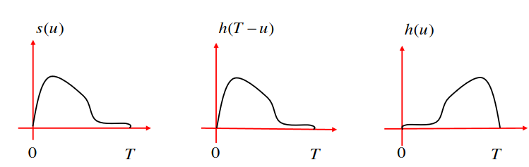
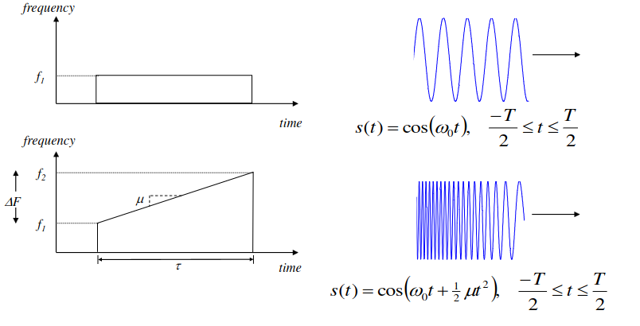
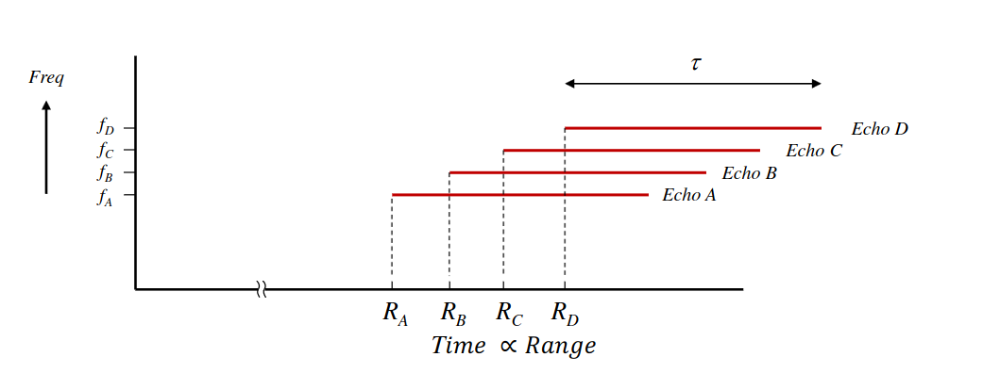

# Radar Peformance
## Matched Filter
### Introduction

- It is almost universally employed in the IF amplifier of modern RADAR systems.
- This is because it yields the highest Signal-To-Noise Ratio at the output, which is important when identifying targets in noisy conditions

### Matched Filter Derivation

1. Consider the noisy input to the IF = the signal to be recovered + white Gauissian Noise:
$r(t) = s(t) + n(t)$, where $n(t)$ has a spectral height $\frac{N_0}{2}$ and $s(t)$ is a signal with finite duration $T$.
2. Let $r(t)$ be the input to a filter with $h(t)$ and let $y(t)$ be the output. Therefore the output of the filter will be given by the convolution integral: $y(t) = \int_{0}^{t} r(\tau) h(t - \tau) d\tau$. 
    - This then means the signal part of the output is: $y_s(t) = \int_{0}^{t} s(\tau) h(t - \tau) d\tau$
    - The noise part is then: $y_n(t) = \int_{0}^{t} n(\tau) h(t - \tau) d\tau$
3. The Signal-to-Noise ratio is then: $SNR = \frac{y_{s}^{2}(t)}{E[y_{n}^{2}(t)]}$ where $E[y_{n}^{2}(t)]$ is the expected part of the noise signal. Then subsitute the equations from part (2) here: $\frac{[\int_{0}^{t} s(u) h(t-u) du]^{2}}{E[\int_{0}^{t} n(u) h(t-u) du]^{2}}$
    - It's squared here, as we need positive values to determine the power
4. The objective here is to find $h(t)$ that maximises this SNR. To do this, we try to simply the noise term: 
    - $E[y_{n}^{2}(t)] = E\left \{ \left [ \int_{0}^{t} n(u) h(t-u) du \right ] \left [ \int_{0}^{t} n(v) h(t-v) dv \right ] \right \}$ *(a)*
    - $E[y_{n}^{2}(t)] = \int_{0}^{t} \int_{0}^{t} E\left \{ n(u)n(v) \right \} h(t-u)h(t-v) dudv$ *(b)*
    - $E[y_{n}^{2}(t)] = \int_{0}^{t} \int_{0}^{t} \frac{N_0}{2} \delta (u-v) h(t-u)h(t-v) dudv$ *(c)*
    - $E[y_{n}^{2}(t)] = \frac{N_0}{2}  \int_{0}^{t} h^{2}(t-u)du$ *(d)*
        - To transition from (b) to (c), we had to assume the noise sources are uncorrelated. Therefore the expected value of the noise will always be 0 EXCEPT for when v = u. This is why we use the dirac delta function with the expected value $\frac{N_0}{2}$
    - Finally we sub (d) into step 3: $SNR = \frac{\left [ \int_{0}^{t} s(u)h(t-u)du \right ]^{2}}{\frac{N_0}{2}  \int_{0}^{t} h^{2}(t-u)du}$

5. Now to maximise the numerator, we use the Cauchy-Schwarz inequality, which states that $\left \langle S, Q \right \rangle^{2} \leq |S|^{2} |Q|^{2}$ where $\left \langle S, Q \right \rangle^{2}$ is the dot product of $S$ and $Q$. Equality is then reached when $cs(u) = q(u)$. If we then sub the $q(u)$ and for $cs(u)$ in the equation, SNR then becomes: 
    - $SNR^{opt}(t) = \frac{\left [ c\int_{0}^{t} s^2(u)du \right ]^2}{\frac{N_{0}c^{2}}{2} \int_{0}^{t} s^{2}(u) du} = \frac{\int_{0}^{t} s^{2}(u)du}{\frac{N_0}{2}}$
6. Finally, as we discussed in step 1, $s(t)$ is a signal with finite duration $T$. Therefore:
    - $SNR^{opt}(t) = \frac{\int_{0}^{T}s^{2}(u)du}{\frac{N_0}{2}} = \frac{2\varepsilon_s}{N_0}$ where $\varepsilon_S$ is the energy of the signal.

### Why it is called the Matched Filter.

- Because it's impulse response is a 'flipped-in-place' version of the original signal.

### Matched Filter Frequency Response

To find the matched filter frequency response, we take the Fourier transform of the impulse response function.
 - $H(f) = \int_{0}^{T} h(u) ^{-j2\pi fu}du$
    - Sub $h(u)$ for $cs(T-u)$ as it is the same, as shown above:
 - $H(f) = c \int_{0}^{T} s(T-u) e^{-j2\pi fu}du$
    - Let $ r = T-u$
- $H(f) = c \int_{0}^{T} s(r) e^{-j2\pi f(T-r)}(-dr)$
    - Remove the $T$ from the integral
- $H(f) = ce^{-j2\pi fT} \int_{0}^{T} s(r) e^{-j2\pi fr} dr$
    - Sub $\int_{0}^{T} s(r) e^{-j2\pi fr} dr$ for $[S(f)]$
- $H(f) = ce^{-j2\pi fT} [S(f)]*$

___

## Pulse Compression
### Introduction

- For long-range transmittion we need to transmit a large amount of energy in order to recieve a readable echo return. This can happen on of two ways: Increased peak power or increase pulse duration
- Disad of peak power: limited by the voltage breakdown chararcteristics
- Disad of longer pulse: poorer range resolution
- **Solution = Pulse Compression**

### Bandwidth

- The range resolution can be improved by increasing the bandwidth of the pulse.
- This is because the dimension of each range cell is defined by the duration of the transmitted pulse: $\Delta R \frac{c \tau}{2} = \frac{c}{2 \beta}$

### LFM Chirp Signal and Bandwidth

- LFM  = Linear frequency modulation.
- The LFM Chirp Signal is shown to have a linear increase of frequency with time.

- To compress the signal, the received signal is first mixed with a time-reversed copy of the original transmitted signal.
- The resulting signal is then passed through a filter that is matched to the shape of the transmitted signal. 
- The matched filter output is then observed, and the time delay at which the peak of the matched filter output occurs corresponds to the time delay between the transmitted signal and the received signal.

### Stretch processing of LFM chirp

- Essentially the opposite of pulse compression, this method stretched the signal in time to acheieve a higher resolution.
- The process of stretch processing is as follows: the recieved signal is mixed with a replica of the original stretched signal. This is then passed through a matched signal, which has been matched to the stretch signals shape. The results is proportional to the the range from the near end of the signal.
- This can then be converted to frequencies.

- Although their pulse echoes almost completely overlap, the slight stagger in their arrival times results in clearly discernible changes in frequency.

### Pulse Compression Ratio
- Another property of the matched filter is that the frequency response of the matched filter increases as the uncompressed pulse width increases.
- The frequency resolution is related to the uncompressed pulse width as: $\Delta f= \frac{1}{\tau}$
- Therefore, for the matched filter to resolve 2 closely-space echoes, the instantaneous differents in their delay-shifted frequencies must meet/exceed 1/$\tau$

Other equations include:
- The rate of change of frequency (chirp rate):
    - $chirp \space rate = \frac{\Delta f}{\tau_{comp}} (Hz/s)$ where $\tau_{comp}$ is the period of time over which the frequency of the uncompressed LFM pulse changes by $\Delta f$
- The bandwidth (AKA total change in frequency):
    - $bandwidth = \Delta F = (\frac{\Delta f}{\tau_{comp}})\tau$
- The pulse compression ratio:
    - $ Pulse \space Compression \space Ratio = \frac{\tau}{\tau_{comp}} = \frac{\Delta F}{\Delta f}$

- The product $\tau \Delta F$ is known as the time-bandwidth product.
- If we set the time-bandwidth product equal to the pulse compression ratio, then $\Delta F = \frac{1}{\tau_{comp}}$