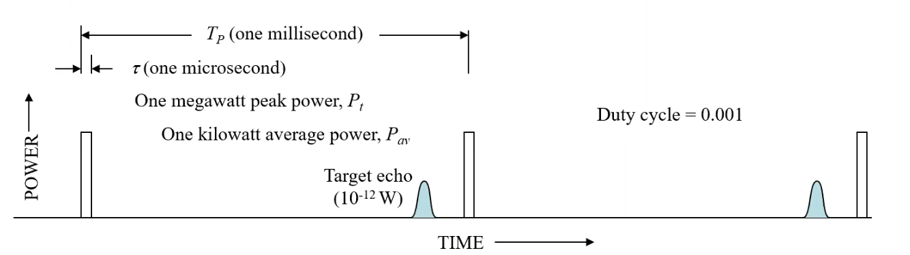
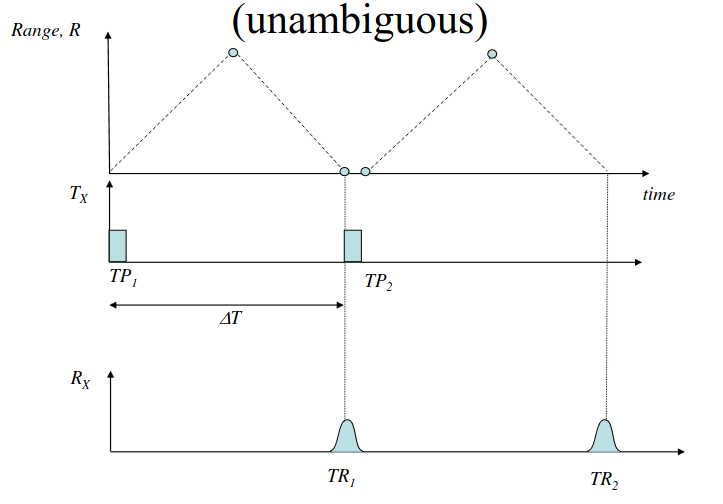
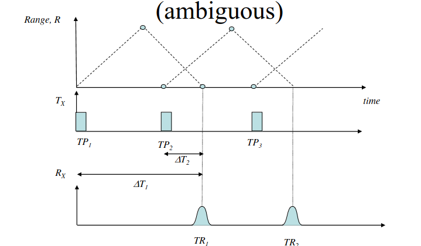
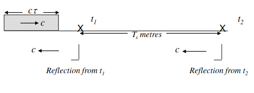
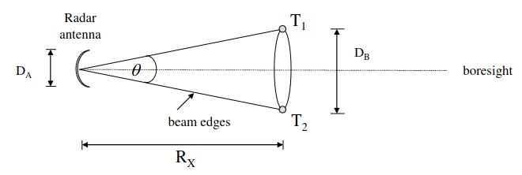
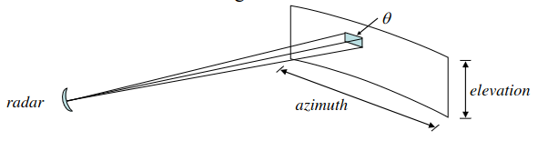

# RADAR Range Measurement & Spatial Resolution

## Introduction

Monostatic pulsed RADAR diagram:

Where:
- $\tau$ = time of pulse
- $T_p$ = time between pulses
- $P_t$ = peak power
- $P_{av}$ = average power

Average power of a pulse-train waveform:

$P_{av} = \frac{P_{t} \tau}{T_p} = P_t \tau f_p$

Duty Cycle:

$ = \frac{\tau}{T_p} = \tau f_p = \frac{P_{av}}{P_t}$

## Range to Target

- The frequency and duration of a RADAR pulse determines the range and range resolution of the RADAR. 
- Equation: $R = \frac{c \Delta t}{2}$
    - $\Delta t$ = time between transmit and receipt of pulses
    - $c$ = speed of light

### Timing (Unambiguous Case)

- From the diagram we can se that the pulses are not sent until the previous pulse is recieved, so that there is no ambiguity in which pulse it is. 
- This means you are always restrainted by the time taken to return.

### Timing (Ambiguous Case)

- In this case, the time berween the transmitted pulse and recieved echo is uncertian, as the RPF is too low to provide a unique measurement.
- This can make the echoes appear to have a closer range that they actually are.

### Maximum Unambiguous Range
- Def: The maximum distance that can be measured without encountering range ambiguity.
- Equation: $R_{un} = \frac{c T_p}{2} = \frac{c}{2 f_p}$
    - $T_p$ is the pulse repetition period
    - $f_p$ is the pulse repetition frequency (PRF)

- From this equation, we can see that is $T_p < \Delta T$, the range measurement is ambiguous.

### Eliminating Ambiguous Returns

#### PRF Jittering

- If there are targets which ranges are beyond $R_{un}$ are not considered, we can solve the problem of ambiguities by rejecting all returns beyond $R_{un}$.
- PRF Jittering can do this by varying the PRF in a controlled way, which makes the echoes from different ranges to be spread out over a range of time, rather than being compressed into a single time interval.
- If the PRF is changed, the apparent range of the target beyond $R_{un}$ will change as well.
- Targets at ranges below $R_{un}$ are unaffected

#### Multiple PRFs Come back to

- But what if the

___

## Range Resolution

 
 - $\tau$ = pulse width (seconds)
 - $c \tau$ = propagation distance (m)

 Range resolution equation:

 $resolution = \frac{c \tau}{2}$

### RADAR Datacube

- Range measurements are always quantised, therefore normally you would seperate target range into discrete range elements known as *cells*.
- This information is then stored in a software structure known as the *datacube*.
___

## Angle Resolution

The diagram below shows 2 targets at the sae range and seperated by an angle $\theta$.

Where:
- $D_A$ = Antenna Diameter
- $D_B$  = Distance between targets
- $R_X$ = Range

Therefore:

$D_B = R_X \theta$ (rads)

### Surveillance Radar Equation

### Derivation
1. Start with a search radar scanning in both azimuth and elevation:

2. Assuming the dimension of the antenna $A_e  \approx L_1 * L_2$, the main lobe solid angle is: $\theta = \frac{\lambda^{2}}{A_{e}}$ **(1)**
3. The total scan time is then: $T_{scan} = T_{i} \cdot \frac{\Phi}{\theta}$ **(2)**
 where $\Phi$ is the total scan solid angle, and $T_{i}$ is the integration time (for detection performance) 
 3. Rearrange **(2)** to make the main lobe solid angle the subject: $\theta = \frac{\Phi T_i}{T_{scan}}$ (3)
 4. For a PRF $f_p$, the number of pulses for integration will be $n = f_p T_i$ (4). Sub (4) into (3): $\theta = \frac{\Phi T_i}{T_{scan}} = \frac{\Phi n}{f_p T_{scan}}$ (5)
 5. Subsituting (5) into (1): $A_e = \frac{\lambda^{2} f_p T_{scan}}{\Phi n}$ (6)
7. Then, to find the average power, assume a matched filer is used $\beta = 1/\tau$, then: $P_{av} = P_t\tau f_p = \frac{P_t f_p}{\beta}$ (7)
8. Then subsitute (6) and (7) into the RADAR Equation ($[S/N]_{min} = \frac{P_t A_e^2 \sigma n}{4 \pi \lambda^2 k T_0 \beta F_n R^4}$): $[S/N]_{min} = P_{av} A_e \frac{T_{scan}}{\Phi} \frac{1}{4 \pi k T_0 F_n} \frac{\sigma}{R^4}$ 
9. Rearrange as a range equation:
$R^4 = P_{av} A_e \frac{T_{scan}}{\Phi} \frac{1}{4 \pi k T_0 F_n} \frac{\sigma}{[S/N]_{min}}$
1. Assuming $F_n$ and $[S/N]_n$ are minimal: $R_{max}^4 \propto \frac{P_{av} A_e}{\Phi / T_{scan}}$

