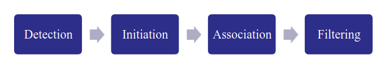
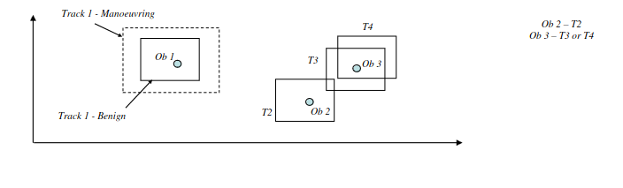

# Target Tracking

The biggest problem in target tracking is one of estimation. We need to esimate due to NOISE, as it is in every signal, and in order to exact our desired signal, we need to estimate the signal from the measured values.

So whay not just use filtering theory for this? Well, the problem is that tracking is much more complex. They are many things to consider:
- Is the measurement real?
- Which target does it belong to?
- How can we optimally predict target motion?

Target tracking systems are made of 4 main functions:

___
## Detection
### RADAR
Modern Automatic Detection and Tracking (ADT) systems detect the targets using signal processing, heuristics and algorithms.
The following sequence of tasks for detection would occur in a RADAR ADT system.
1. Quantise in range and in angle to create discrete cells
1. Apply dynamic thresholding to obtain a Constant False Alarm Rate (CFAR)
1. Integrate the pulse returns from each cell
1. Declare detection is m out n pulses exceeds the threshold

### EO
There are two main approaches for detection within an EO image: **Correlation** and **Centroiding**. The choice is depend on whether it is an *extended* or *point* target.

If it extended, then correlation is used. 
- This works by using a template image of the desired target and passing it along the measured image. 
- If the target is within the scence and is being viewed from the same aspect, then there will be a spike in the cross-correlation function.

If it is a point target, then centroiding is used:
- This works by turning the image from greyscale to binary.
- Then the centroid of each 'white' cluster is found, and the centre of the target is obtained.

---
## Initiation
- This phase bridges the gap between hardware and software.
- Basically, the function of this segment is to apply a heuristic to the measurements delivered, and if it returns true, initiate a new track entity in the database. 
- A simple example would be "3 from 4" heuristic i.e. if observations and recieved in the same/neigbouring cell for 3 out 4 consecutive scans, return true.

---
## Association
- The objective of this stage is to match a new observation to an existing tracks.
- This process uses track gates, as shown below:

- To this decision rules (like distance metrics) can be used.
- Dynamic size gating is also used (if the target is highly manoeuvrable, use a bigger gate)

___

## Filtering

