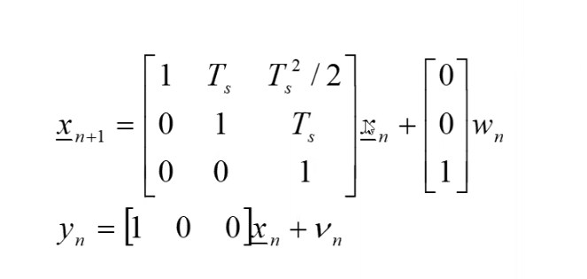
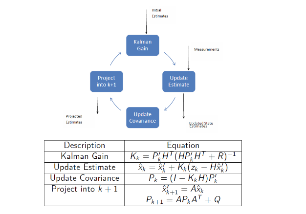

# Target Tracking

The biggest problem in target tracking is one of estimation. We need to esimate due to **noise**, as it is in every signal, and in order to exact our desired signal, we need to estimate the signal from the measured values.

So whay not just use filtering theory for this? Well, the problem is that tracking is much more complex. They are many things to consider:
- Is the measurement real?
- Which target does it belong to?
- How can we optimally predict target motion?

Target tracking systems are made of 4 main functions:

___
## Detection
### RADAR
Modern Automatic Detection and Tracking (ADT) systems detect the targets using signal processing, heuristics and algorithms.
The following sequence of tasks for detection would occur in a RADAR ADT system.
1. Quantise in range and in angle to create discrete cells
1. Apply dynamic thresholding to obtain a Constant False Alarm Rate (CFAR)
1. Integrate the pulse returns from each cell
1. Declare detection is m out n pulses exceeds the threshold

### EO
There are two main approaches for detection within an EO image: **Correlation** and **Centroiding**. The choice is depend on whether it is an *extended* or *point* target.

If it extended, then correlation is used. 
- This works by using a template image of the desired target and passing it along the measured image. 
- If the target is within the scence and is being viewed from the same aspect, then there will be a spike in the cross-correlation function.

If it is a point target, then centroiding is used:
- This works by turning the image from greyscale to binary.
- Then the centroid of each 'white' cluster is found, and the centre of the target is obtained.

---
## Initiation
- This phase bridges the gap between hardware and software.
- Basically, the function of this segment is to apply a heuristic to the measurements delivered, and if it returns true, initiate a new track entity in the database. 
- A simple example would be "3 from 4" heuristic i.e. if observations and recieved in the same/neigbouring cell for 3 out 4 consecutive scans, return true.

---
## Association
- The objective of this stage is to match a new observation to an existing tracks.
- This process uses track gates, as shown below:

- To this decision rules (like distance metrics) can be used.
- Dynamic size gating is also used (if the target is highly manoeuvrable, use a bigger gate)

___

## Filtering (+ State Estimation)
### Introduction 
- Aim: to get the underlying estimate using the observations from your sensors, as close as we can to the true measurement

- Issues:
    - Long revisit times
    - Inaccurate position estimation 
    - Sensor inaccuracies (noises, biases)

### $\alpha-\beta$ filter 
Its a sub-optimal filter, closely related to the Kalman Filter. 

Filter equations
- $\hat{x}_n = \hat{x}_{n}^{-} + \alpha (x_n -\hat{x}_{n}^{-})$ **(1)**
    - This equation is known as the difference equation.
    - **In simple terms, this equation finds the difference between the true value and estimate value at the current time step, multiplies that difference by $\alpha$ and adds it to the current (*a priori*) value of the state estimate.**
    - The '$\space \hat{} \space$' means that the value is an estimate, and the $n$ refers to the time step we are at. 
    - The '$\space s^{-} \space $' and '$\space s^{+} \space $' values state whether a value is *a priori* or *a posteriori*.
        - *A priori* is before the value has been changed, and *a posteriori* is after the value has been changed.
        - For example in the code ` x = x + 1`, the `x` on the left hand size is *a posteriori* and the `x` on the right is *a priori*.
    - $a$ here acts a smoothing parameter, and is always a value between 0 and 1. 
- $\hat{\dot{x}}_n = \hat{\dot{x}}_{n-1} + \frac{\beta}{T_s} (x_n -\hat{x}_{n}^{-})$ **(2)**
    - This equation is known as the difference equation for the rate of change of the state
    - **In simple terms, this equation finds the current rate of change state, by finding the difference of the true value and estimate value at the current time step, multiplying it by $\frac{\beta}{T_s}$ , and adding this to the previous rate of change state.**
    - The $\dot{s}$ means the rate of change of a state. Since this is not measured by the sensor, this must be calculated and stored for the next time step.
        - For example, if you were measuring **range**, the $\hat{\dot{x}}$ would be the range of change of range AKA **velocity**. 
    - The $T_s$ means the time between samples, and this is used with the difference equation to make sure the correct units are being used.
- $\hat{x}_{n+1} = \hat{x}_{n} + \hat{\dot{x}}_{n}T_s$ **(3)**
    - Euler integration to get to get to the next state.
### $\alpha - \beta - \gamma$ filter

Bascially the same thing as the $\alpha-\beta$ filter, but has an acceleration term, and slightly different integration term. This is used if the target is highly manoeurvable.

Equations:
- $\hat{\ddot{x}}_{n} = \hat{\ddot{x}}_{n-1} + \frac{\gamma}{{T_{s}}^{2}} (x_n - \hat{x}_{n}^{-})$ 

- $\hat{x}_{n+1} = \hat{x}_{n} + \hat{\dot{x}}_{n} T_s + \frac{{T_s}^2}{2} \hat{\ddot{x}}_{n}$

Mean squared error calculations:
- Measurements: $\varepsilon =\frac{1}{N} \sum_{n=1}^{N}(x_n - y_n)^2$
- Filter output: $\varepsilon = \frac{1}{N}\sum_{n=1}^{N}(x_n - \hat{x}_n)^2$

### Selecting alpha and beta values
- Bandwidth of the filter depends of alpha
    - a = 1, rapid response to manoeuvring targets, wide bandwidth
    - a = 0 , good smoothing of errors, narrow bandwidth
- Setting beta is normally a function of alpha
    - Benedict-Bordner equation will minimise output noise variance at steady states
    - Also, the target motion can be approximated by discrete white noise acceleration errors
### Kalman filter
For more accurate smoothing prediction, a Kalman filter is better as it incorporates models of both the target dynamcis and the errors in the model and measurements.

Linear state matrix:

- $w_n$ = process noise matrix
- $x_n$ = state matrix
- $y_n$ = measurment matrix
- $v_n$ = measurment noise matrix

 

**Add to notes in my own time**

___

## Tracking Hardware - RADAR

### Automatic Detection & Track (ADT)
- Used in civilian (+ military ) ATC system
- Incorporates a tracking function within a survellance radar system (constant rotation)
- Can track thousands of targets simulataneously
- Slower revisit time (data rate) than STT or TWS trackers

### Track-While-Scan (TWS)
- Works by scanning a relatively small sector of space, but still tracks multiple targets at once.

### Single-Target Tracker (STT)
- Designed to maintain the RADAR boresight (target aim) on a single target at all time with a relatively high data rate
- Uses off-boresight aziumth and elevation errors to help position the antenna
- Used in military fire-control RADAR

### Phased-Array Tracker
- Constructed from a large number of individual radiating elements.
- Beam steering is accomplished by adjusting the relative amplitude and phase on each element to steer the wavefront.

___

## Tracking Hardware - EO System
